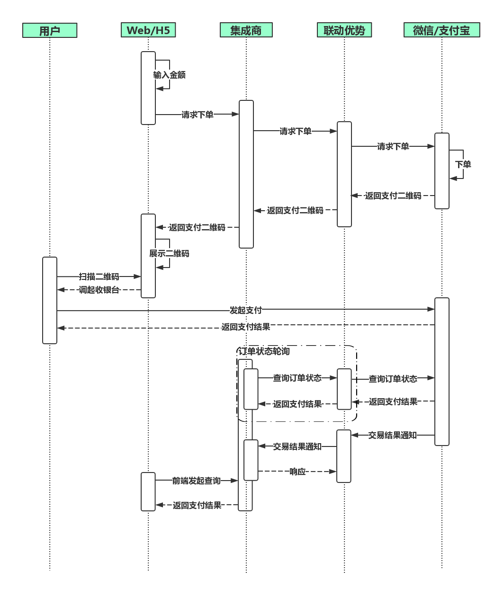

# 用户主扫

**简要描述：** 

- 商户->联动优势
- 商户通过下单接口获取指定支付方式的二维码并展示给消费者，消费者使用微信/支付宝/银联钱包等扫码完成支付
- 请通过主动调用**2.6订单状态同步**接口，配合**3.1交易结果通知**（异步回调）来保证订单状态一致性
- 交易时序图如下


**请求URL：** 
`https://mofunapi.umfintech.com/in-pay-client/api/activescan`

  
**请求方式：**
- POST 

**请求报文参数：** 

|	字段	|	名称	|	长度	|	必填	|	说明	|
|----|----|----|----|----|
|	partnerOrderId	|	商户订单号	|	32	|	M	|	商户的支付订单号	|
|	subMerId	|	商户号	|	8	|	M	|	商户号(联动平台分配)	|
|	amount	|	付款金额	|	13	|	M	|	是人民币，且以分为单位	|
|	payType	|	支付类型	|	2	|	M	|	WX：微信刷卡支付<br>AL：Alipay支付宝条码支付<br>YL：银联二维码支付	|
|	proxyId	|	集成商ID	|	4	|	M	|	集成商唯一标识（同魔方平台登录账号）	|
|	apiVersion	|	版本	|	3	|	M	|	定值:1.0	|
|	reqDate	|	请求日期	|	8	|	M	|	yyyyMMdd	|
|	reqTime	|	请求时间	|	6	|	M	|	HHmmss	|
|	sign	|	签名	|	256	|	M	|	参见签名机制	|
|	goodsInfo	|	商品信息	|	128	|	O	|	可上送商品描述、商户订单号等信息，用户付款成功后会在微信账单页面展示	|
|	shopNo	|	门店编号	|		|	O	|	门店编号	|
|	operator	|	收银员	|		|	O	|	收银员账号（惠商体系，必须跟门店匹配）	|
|	expairTime	|	订单有效时间(秒)	|	600	|	O	|	当传递小于300秒或大于1800秒或不传递时系统默认为300秒<br>订单有效时间从调起用户密码键盘开始算起，超时之后,用户无法继续支付。	|
|	posSN	|	POSSN	|		|	O	|	POS唯一标识，可用于关联UPOS	|
|	notifyUrl	|	通知地址	|	256	|	O	| 	结果通知地址. 必须以 http:// 或 https:// 开始, 支持大小写字母,数字,'/','&','%','?','=' . 暂不支持通知地址中包含其他字符,包含url编码后的结果 如%3C %3E等	|
|	<span style="color:red">location</span>	|	受理终端设备实时经纬度信息	|	32	|	O	|	受理终端设备实时经纬度信息，格式为纬度/经度，+表示北纬、东经，-表示南纬、西经。+37.12/-121.213,超过字段长度截断	| |
|	<span style="color:red">deviceIp</span>	|	商户端终端设备IP地址	|	40	|	O	|	商户端终端设备IP地址	| |
|	<span style="color:red">networkLicense</span>	|	银行卡受理终端产品应用认证编号	|	5	|	O	|	银行卡受理终端产品应用认证编号。该编号由“中国银联标识产品企业资质认证办公室”为通过入网认证的终端进行分配。银联直连终端必填。格式：5位字符，例如P3100	| |
|	<span style="color:red">deviceId</span>	|	设备id	|	8	|	O	|	设备id	| |
|	<span style="color:red">encryptRandNum</span>	|	加密随机因子	|	10	|	O	|	加密随机因子，仅在被扫支付类交易报文中出现：若付款码为19位数字，则取后6位；若付款码码为EMV二维码，则取其tag57的卡/token号的后6位	| |
|	<span style="color:red">secretText</span>	|	密文数据	|	16	|	O	|	密文数据，仅在被扫支付类交易报文中出现：64bit的密文数据，对终端硬件序列号和加密随机因子加密后的结果。本子域取值为：64bit密文数据进行base64编码后的结果。	| |
|	<span style="color:red">appVersion</span>	|	终端应用程序的版本号	|	8	|	O	|	应用程序变更，应保证版本号不重复。当长度不足时右补空格。	| |
|	<span style="color:red">mobileCountryCd</span>	|	移动国家代码	|	3	|	O	|	基站信息，由国际电联(ITU)统一分配的移动国家代码（MCC）。	| |
|	<span style="color:red">mobileNetNum</span>	|	移动网络号码	|	2	|	O	|	基站信息，移动网络号码，由国际电联(ITU)统一分配的移动网络号码（MNC）。	| |
|	<span style="color:red">iccId</span>	|	ICCID	|	20	|	O	|	SIM卡卡号	| |
|	<span style="color:red">locationCd1</span>	|	位置区域码1	|	4	|	O	|	位置区域码1,LAC(移动、联通)，16进制	| |
|	<span style="color:red">lbsNum1</span>	|	基站编号1	|	12	|	O	|	基站编号1，CID(移动、联通)，16进制	| |
|	<span style="color:red">lbsSignal1</span>	|	基站信号1	|	4	|	O	|	基站信号1，SIG(移动、联通)，16进制	| |
|	<span style="color:red">locationCd2</span>	|	位置区域码2	|	12	|	O	|	位置区域码2，LAC(移动、联通)，16进制	| |
|	<span style="color:red">lbsNum2</span>	|	基站编号2	|	4	|	O	|	基站编号2，CID(移动、联通)，16进制	| |
|	<span style="color:red">lbsSignal2</span>	|	基站信号2	|	4	|	O	|	基站信号2，SIG(移动、联通)，16进制	| |
|	<span style="color:red">locationCd3</span>	|	位置区域码3	|	12	|	O	|	位置区域码3，LAC(移动、联通)，16进制	| |
|	<span style="color:red">lbsNum3</span>	|	基站编号3	|	12	|	O	|	基站编号3，CID(移动、联通)，16进制	| |
|	<span style="color:red">lbsSignal3</span>	|	基站信号3	|	4	|	O	|	基站信号3，SIG(移动、联通)，16进制	| |
|	<span style="color:red">telecomSysId</span>	|	电信系统识别码	|	4	|	O	|	电信系统识别码，SID（电信），电信系统识别码,每个地级市只有一个SID	| |
|	<span style="color:red">telecomNetId</span>	|	电信网络识别码	|	4	|	O	|	电信网络识别码，NID（电信），电信网络识别码,由电信各由地级分公司分配。每个地级市可能有1到3个NID	| |
|	<span style="color:red">telecomLbs</span>	|	电信基站	|	4	|	O	|	电信基站，BID（电信），电信网络中的小区识别码，等效于基站	| |
|	<span style="color:red">telecomLbsSignal</span>	|	电信基站信号	|	4	|	O	|	电信基站信号，SIG（电信），16进制	| |


 **商户请求报文示例**

```json 
context={
	"amount": "99999",
	"subMerId": "30000102",
	"payType": "WX",
	"apiVersion": "1.0",
	"reqDate": "20180313",
	"partnerOrderId": "HSAPI1520909695265",
	"sign": "MMokEDpwU7vHy2AP2o4esBBLHRdsn3BorIdSHkbGpEOEAr9USwj++l9K8lyder2Yy/WmtEhyEL9xKiX4mS14ds7OKdzX6tGzy4qc2lsdRRSe5l9I9Gj7NdCLsq1TUccr2gnGibvu9UaAsCUCNmJqBrSW0YUl7+mVND9FFGecBe0=",
	"reqTime": "105455",
	"operator": "htcs2",
	"proxyId": "0049"
}
```

 **返回参数说明** 

|	字段	|	名称	|	长度	|	必填	|	说明	|
|----|----|----|----|----|
|	retCode	|	返回码	|	8	|	M	|	返回码	|
|	Memo	|	返回信息	|	128	|	M	|	返回信息	|
|	tradeNo	|	平台处理流水 	|		|	M	|	平台处理流水（对账及打印小票使用）	|
|	platDate	|	平台日期	|		|	M	|	平台日期（对账,退款及打印小票使用）	|
|	amount	|	付款金额	|	13	|	M	|	是人民币，且以分为单位	|
|	payType	|	支付类型	|		|	M	|	WX：微信刷卡支付<br>AL：Alipay支付宝条码支付<br>YL：银联二维码支付	|
|	feeUrl	|	缴费二维码地址	|		|	M	|	成功时返回内容，失败返回空字符串	|
|	partnerOrderId	|	商户订单号	|	32	|	O	|	支付订单号	|
|	sign	|	签名	|	256	|	M	|	参见签名机制	||
|	<span style="color:red">userId</span>	|	用户唯一编码	|	128	|	O	|	用户唯一编码	| |
|	<span style="color:red">terminalIp</span>	|	绑卡设备（付款APP）所在的公网IP	|	64	|	O	|	绑卡设备（付款APP）所在的公网IP，可用于定位所属地区，不是wifi连接时的局域网IP。局域网IP包括：A类：10.0.0.0-10.255.255.255 B类：172.16.0.0-172.31.255.255 C类：192.168.0.0-192.168.255.255	| |
|	<span style="color:red">terminalLocation</span>	|	（付款APP）设备GPS位置	|	32	|	O	|	（付款APP）设备GPS位置，格式为纬度/经度，+表示北纬、东经，-表示南纬、西经。	| |


 **备注** 
- 更多返回错误代码请看[全局参数说明](单页面地址 : http://apidocs.huishangplus.com/#/globalparamexplain "全局参数说明")
