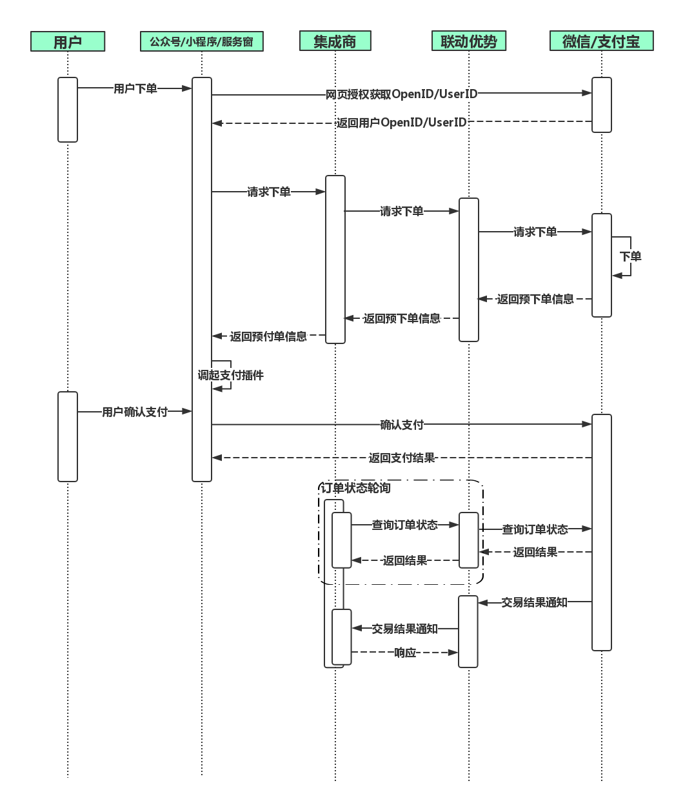

# 公众号/小程序支付

**简要描述：** 
- 商户->联动优势
- 商户通过接口下单成功后，使用返回的预下单信息在微信公众号、微信小程序或支付宝服务窗中调起支付插件，消费者完成支付。调起支付插件方法参考如下：  

  微信：https://pay.weixin.qq.com/wiki/doc/api/jsapi.php?chapter=7_7  
  支付宝：https://docs.open.alipay.com/common/105591  

- 请通过主动调用**2.6订单状态同步**接口，配合**3.1交易结果通知**（异步回调）来保证订单状态一致性
- 交易时序图如下


**请求URL：**   

`https://mofunapi.umfintech.com/in-pay-client/api/unifiedcode`
  
**请求方式：**
- POST


**请求数据：** 

|	字段	|	名称	|	长度	|	必填	|   说明|	示例	|
| ---- |: ---- |:----- |:----- |:---- :|----- :|
|	partnerOrderId	|	商户订单号	|	32	|	M	|	商户的支付订单号|180509171323918113335	|
|	subMerId	|	商户号	|	8	|	M	|	商户号(联动平台分配)|30200102	|
|	amount	|	订单金额	|	10	|	M	|	单位:分|	100|
|	payType	|	支付类型	|	2	|	M	|WX： 微信支付 </br> AL： 支付宝支付|	WX	|
|	openId	|	微信或支付宝用户标识	|	28	|	M	|微信上传用户openid；</br> 支付宝上传用户user_id；	|	微信openid：oUMnsvyNYu6pjDvpJzcXe3PvGXPY </br> 支付宝user_id：2088522626852000|
|	appId	|	APPID	|	18	|	C	|微信及支付宝的AppId，如获取OpenID所使用的AppID非下单商户主体资质，则该字段无需上传	|	wx102e43f81031d8d6|
|	proxyId	|	集成商ID	|	4	|	M	|	集成商唯一标识（同魔方登录账号）	|0097|
|	apiVersion	|	版本	|	3	|	M	|传递:1.0	|1.0		|
|	sign	|	签名	|	256	|	M	|参见签名机制	|	|
|	shopNo	|	门店编号	|		|	O	|	门店编号	|
|	operator	|	操作人	|		|	O	|	操作人	|
|	goodsInfo	|	商品信息	|	80	|	O	|可上送商品描述、商户订单号等信息，用户付款成功后会在微信账单页面展示|例：家政培训费（订单号2018080812635453）|
|	sub_appid	|	子商户appid	|	18	|	O	|二级商户的appId	|	wx102e43f81031d8d6|
|	remark	|	扩展信息	|	128	|	O	|	保留扩展字段，以 "&#124;"（竖线）分隔	| 扩展信息1&#124;扩展信息2|
|	reduceAmt	|	抵扣金额	|	10	|	O	|	商家优惠金额	|0|
|	expairTime	|	订单有效时间(秒)	|	4	|	O	|当传递小于300秒或大于1800秒或不传递时系统默认为300秒。订单有效时间从调起用户密码键盘开始算起，超时之后,用户无法继续支付。	|600	|
|	<span style="color:red">location</span>	|	受理终端设备实时经纬度信息	|	32	|	O	|	受理终端设备实时经纬度信息，格式为纬度/经度，+表示北纬、东经，-表示南纬、西经。+37.12/-121.213,超过字段长度截断	| |
|	<span style="color:red">deviceIp</span>	|	商户端终端设备IP地址	|	40	|	O	|	商户端终端设备IP地址	| |
|	<span style="color:red">networkLicense</span>	|	银行卡受理终端产品应用认证编号	|	5	|	O	|	银行卡受理终端产品应用认证编号。该编号由“中国银联标识产品企业资质认证办公室”为通过入网认证的终端进行分配。银联直连终端必填。格式：5位字符，例如P3100	| |
|	<span style="color:red">deviceType</span>	|	设备类型	|	2	|	O	|	取值范围：（终端注销时非必填）取值 取值说明：01 自动柜员机（含 ATM 和 CDM）和多媒体自助终端、02 传统 POS、03 mPOS、04 智能 POS、05 II 型固定电话、06 云闪付终端、07 保留使用、08 手机 POS、09 刷脸付终端、10 条码支付受理终端、11 辅助受理终端、12行业终端（公交、地铁用于指定行业的终端）、13 MIS 终端	| |
|	<span style="color:red">deviceId</span>	|	设备id	|	8	|	O	|	设备id	| |
|	<span style="color:red">encryptRandNum</span>	|	加密随机因子	|	10	|	O	|	加密随机因子，仅在被扫支付类交易报文中出现：若付款码为19位数字，则取后6位；若付款码码为EMV二维码，则取其tag57的卡/token号的后6位	| |
|	<span style="color:red">secretText</span>	|	密文数据	|	16	|	O	|	密文数据，仅在被扫支付类交易报文中出现：64bit的密文数据，对终端硬件序列号和加密随机因子加密后的结果。本子域取值为：64bit密文数据进行base64编码后的结果。	| |
|	<span style="color:red">appVersion</span>	|	终端应用程序的版本号	|	8	|	O	|	应用程序变更，应保证版本号不重复。当长度不足时右补空格。	| |
|	<span style="color:red">mobileCountryCd</span>	|	移动国家代码	|	3	|	O	|	基站信息，由国际电联(ITU)统一分配的移动国家代码（MCC）。	| |
|	<span style="color:red">mobileNetNum</span>	|	移动网络号码	|	2	|	O	|	基站信息，移动网络号码，由国际电联(ITU)统一分配的移动网络号码（MNC）。	| |
|	<span style="color:red">iccId</span>	|	ICCID	|	20	|	O	|	SIM卡卡号	| |
|	<span style="color:red">locationCd1</span>	|	位置区域码1	|	4	|	O	|	位置区域码1,LAC(移动、联通)，16进制	| |
|	<span style="color:red">lbsNum1</span>	|	基站编号1	|	12	|	O	|	基站编号1，CID(移动、联通)，16进制	| |
|	<span style="color:red">lbsSignal1</span>	|	基站信号1	|	4	|	O	|	基站信号1，SIG(移动、联通)，16进制	| |
|	<span style="color:red">locationCd2</span>	|	位置区域码2	|	12	|	O	|	位置区域码2，LAC(移动、联通)，16进制	| |
|	<span style="color:red">lbsNum2</span>	|	基站编号2	|	4	|	O	|	基站编号2，CID(移动、联通)，16进制	| |
|	<span style="color:red">lbsSignal2</span>	|	基站信号2	|	4	|	O	|	基站信号2，SIG(移动、联通)，16进制	| |
|	<span style="color:red">locationCd3</span>	|	位置区域码3	|	12	|	O	|	位置区域码3，LAC(移动、联通)，16进制	| |
|	<span style="color:red">lbsNum3</span>	|	基站编号3	|	12	|	O	|	基站编号3，CID(移动、联通)，16进制	| |
|	<span style="color:red">lbsSignal3</span>	|	基站信号3	|	4	|	O	|	基站信号3，SIG(移动、联通)，16进制	| |
|	<span style="color:red">telecomSysId</span>	|	电信系统识别码	|	4	|	O	|	电信系统识别码，SID（电信），电信系统识别码,每个地级市只有一个SID	| |
|	<span style="color:red">telecomNetId</span>	|	电信网络识别码	|	4	|	O	|	电信网络识别码，NID（电信），电信网络识别码,由电信各由地级分公司分配。每个地级市可能有1到3个NID	| |
|	<span style="color:red">telecomLbs</span>	|	电信基站	|	4	|	O	|	电信基站，BID（电信），电信网络中的小区识别码，等效于基站	| |
|	<span style="color:red">telecomLbsSignal</span>	|	电信基站信号	|	4	|	O	|	电信基站信号，SIG（电信），16进制	| |
|	<span style="color:red">areaInfo</span>	|	地区信息	|	6	|	O	|	商户所在地地区信息，6 位定长，精确到区县编码维度，与国家统计局一致。注：取值范围可参考《省市区结构说明》	| |
		


 **商户请求报文示例**
```json
context={
	"subMerId": "30000102",
	"amount": "9",
	"payType": "WX",
	"apiVersion": "1.0",
	"partnerOrderId": "HSAPI1520425994612",
	"openId": "122010000151",
	"appId": "111",
	"sign": "FI8kw10QzZICpj2xRjsYcmU+HI7oNFm4KaNSPeT4YbmG7izCV4m9jZJQ1gxkny0bt5xY8MZXXtzFeRR5KEyzp2YFYMC0AFjvsd/5HGlE6JxrVKNg/LhIba7aR7WMrX4FtEcmBm4ILMosgVhf665KgGtdHBuCd5qRfAs217iPWd0=",
	"proxyId": "0049"
}
```
 **返回参数说明** 


|字段|名称|长度|必填|说明|示例|
|---|---|---|---|---|---|
|	retCode	|	返回码	|	8	|	M	|0000支付成功	|	0000|
|	subMerId	|	商户号	|	8	|	M	|同原请求	|	30200102|
|	resDate	|	响应日期	|		|	M	|格式：yyyyMMdd	|20180223	|
|	resTime	|	响应时间	|		|	M	|格式：HHmmss	|	172344|
|	payType	|	支付类型	|		|	M	|WX： 微信刷卡支付</br>AL: Alipay支付宝条码支付	|	WX|
|	openId	|	用户授权标识	|		|	M	|		|122010000151|
|	appId	|	APPID	|		|	M	|	微信及支付宝的AppId|	2c91aa1843444d09a5a7ca811955bbe2|
|	Memo	|	返回码描述	|		|	M	|	|	交易成功|
|	prepayId	|	预支付ID	|		|	M	|调起支付插件需要	|	prepay_id=wx091722014693444a557c8f280689718193|
|	hostLsNo	|	交易流水号	|		|	M	|	|	8229172300153405|
|	timestamp	|	时间戳	|		|	C	|调起微信支付插件需要，支付宝可不填	|	1525857061537|
|	partnerOrderId	|	商户订单号	|		|	M	|同原请求	|180509171323918113335|
|	nonceStr	|	随机数	|		|	C	|调起微信支付插件需要，支付宝可不填	|	1525857061537|
|	signType	|	签名算法	|		|	C	|调起微信支付插件需要，支付宝可不填|		MD5|
|	paySign	|	H5签名	|		|	C	|调起微信支付插件需要，支付宝可不填	|	73DBF7459A11BCCED6D8F45EA660A416|
|	sign	|	签名	|	256	|	M	|参见签名机制	||
|	<span style="color:red">userId</span>	|	用户唯一编码	|	128	|	O	|	用户唯一编码	| |
|	<span style="color:red">terminalIp</span>	|	绑卡设备（付款APP）所在的公网IP	|	64	|	O	|	绑卡设备（付款APP）所在的公网IP，可用于定位所属地区，不是wifi连接时的局域网IP。局域网IP包括：A类：10.0.0.0-10.255.255.255 B类：172.16.0.0-172.31.255.255 C类：192.168.0.0-192.168.255.255	| |
|	<span style="color:red">terminalLocation</span>	|	（付款APP）设备GPS位置	|	32	|	O	|	（付款APP）设备GPS位置，格式为纬度/经度，+表示北纬、东经，-表示南纬、西经。	| |


 **备注** 


- 更多返回错误代码请看[全局参数说明](单页面地址 : http://apidocs.huishangplus.com/#/globalparamexplain "全局参数说明")
